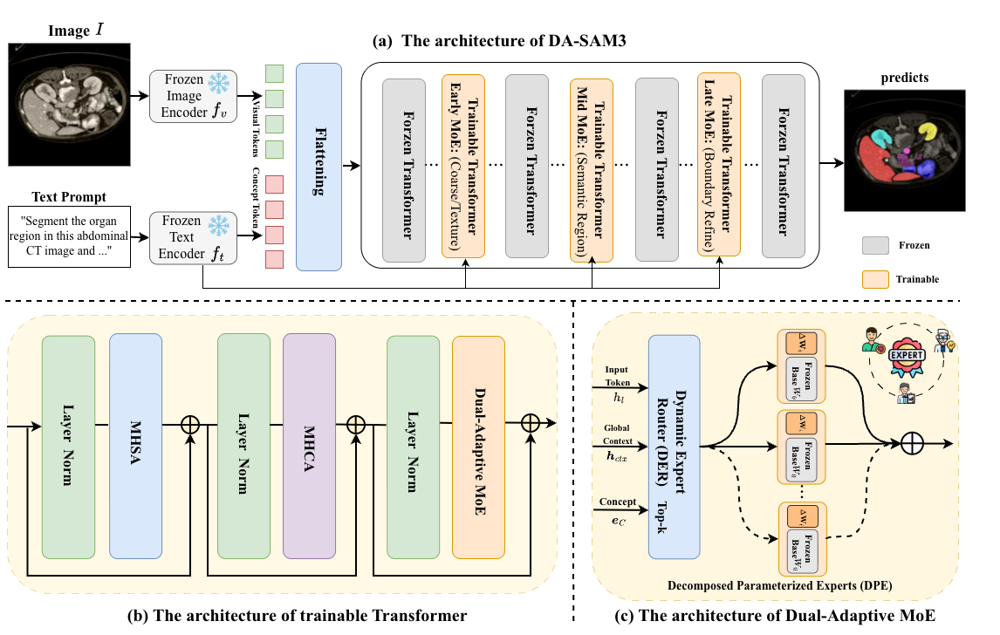

# Dual-Adaptive SAM3: Hierarchical Routing over Low-Rank Expert Layers for Parameter-Efficient Medical Image Segmentation



Official implementation of **Dual-Adaptive SAM3 (DA-SAM3)** for parameter-efficient medical image segmentation with natural language prompts.

DA-SAM3 adapts SAM3 to medical imaging via two complementary mechanisms:

1. **Dynamic Expert Router (DER)** — sparse, multimodal expert selection conditioned on visual content and text concepts
2. **Decomposed Parameterized Experts (DPE)** — shared frozen SAM3 FFN base + lightweight low-rank expert deltas

## Architecture

```
Frozen SAM3 Image Encoder (ViT)
Frozen SAM3 Text Encoder (CLIP-style)
Trainable Fusion Encoder with DA-MoE at layers {L/6, L/4, L/2}
  ├── DER: CrossAttn(C_tok, Pool(V)) → token-wise top-k routing
  └── DPE: E_i(x) = (W0 + A_i B_i^T) x
Frozen DETR Decoder + Segmentation Head
```

## Project Structure

```
DA-SAM3/
├── da_sam3/
│   ├── models/          # DA-MoE layer, model builder
│   ├── integration/     # SAM3 fusion encoder patcher
│   ├── losses/          # Dice + Focal + MoE aux losses
│   ├── data/            # Medical datasets + SAM3 datapoint builder
│   └── utils/           # Checkpoints, metrics (DSC/HD)
├── configs/             # Training configuration
├── train.py             # Stage 1 (warmup) / Stage 2 (routing)
├── infer.py             # Text-prompt inference
├── validate.py          # Benchmark evaluation
└── scripts/setup_env.sh # SAM3 path setup
```

## Dependencies

DA-SAM3 builds on [Medical-SAM3](https://github.com/Chongcong/Medical-SAM3) for the SAM3 backbone. Related reference works:

| Reference | Role in DA-SAM3 |
|-----------|-----------------|
| Medical-SAM3 | SAM3 backbone, fusion encoder, medical training pipeline |
| MedSAM3 | LoRA/PEFT patterns, COCO datapoint format |
| MoE-SAM | Dynamic expert routing (DER inspiration) |
| SAM-Adapter | Parameter-efficient adaptation philosophy |

## Setup

```bash
git clone https://github.com/Reconsider80/DA-SAM3.git
cd DA-SAM3

# Clone SAM3 backbone (required)
git clone https://github.com/Chongcong/Medical-SAM3.git ../Medical-SAM3

pip install -r requirements.txt
pip install -e .
pip install -e "../Medical-SAM3/Medical-SAM3-main[train]"

export SAM3_ROOT="../Medical-SAM3/Medical-SAM3-main"
export PYTHONPATH="${SAM3_ROOT}:${SAM3_ROOT}/sam3:${PYTHONPATH}"
```

Set `HF_TOKEN` if downloading SAM3 weights from HuggingFace.

## Data Preparation

Organize each benchmark as:

```
data/synapse/
├── images/
├── masks/
├── prompts.json      # optional: {"case001": "spleen", ...}
├── train.txt         # optional: one case id per line
└── test.txt
```

Supported datasets: `synapse`, `mmwhs`, `btcv`, `acdc`.

## Training

**Stage 1 — Expert Specialization (warmup):**

```bash
python train.py --config configs/da_sam3_default.yaml --stage warmup
```

**Stage 2 — Routing Calibration:**

```bash
python train.py --config configs/da_sam3_default.yaml \
    --stage routing \
    --resume outputs/da_sam3/best_warmup.pt
```

Key hyperparameters:

| Parameter | Value |
|-----------|-------|
| Experts | 4 |
| Top-k | 2 |
| LoRA rank | 8 |
| Batch size | 8 |
| Learning rate | 5e-4 |
| λ₁ (balance) | 0.01 |
| λ₂ (sparse) | 0.001 |

## Inference

```bash
python infer.py \
    --config configs/da_sam3_default.yaml \
    --checkpoint outputs/da_sam3/best_warmup.pt \
    --image path/to/ct_slice.png \
    --prompt "left ventricle" \
    --output result.png
```

## Evaluation

```bash
python validate.py \
    --config configs/da_sam3_default.yaml \
    --checkpoint outputs/da_sam3/best_warmup.pt
```

## Citation

```bibtex
@article{chen2026dasam3,
  title={Dual-Adaptive SAM3: Hierarchical Routing over Low-Rank Expert Layers for Parameter-Efficient Medical Image Segmentation},
  author={Chen, Ying and Li, Jinyue and Wang, Kun and Li, Qiankun and Liu, Yang},
  year={2026}
}
```

## License

Research use only. SAM3 weights are subject to Meta's license.
